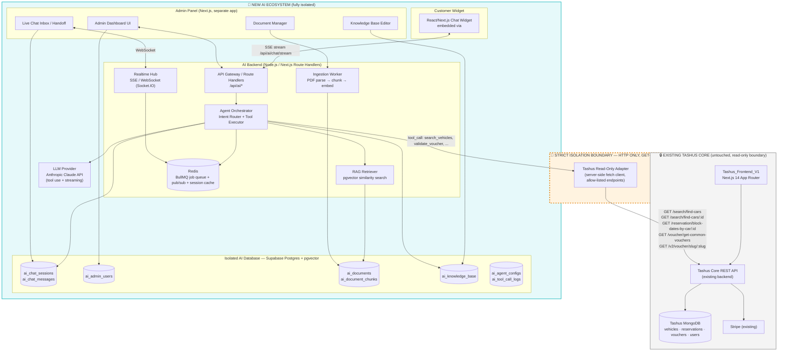

# Tashus AI Chatbot Ecosystem — Implementation Plan & Blueprint
`ai_ecosystem_plan.md`

> **Status:** Definitive engineering blueprint — ready for agent/engineer execution.
> **Project Lead:** Golam Shafi Afroze Mia (Front-End Engineer & UI/UX Designer)
> **Source of Truth (existing system):** `Tashus_Frontend_V1` blueprint (see `blueprint.md`) — Next.js 14.2.4 App Router, TypeScript, MongoDB-backed REST API, NextAuth JWT, Stripe, Cloudinary.
> **Prime Directive:** The AI Ecosystem is a **new, isolated service**. It never writes to, migrates, or shares infrastructure with the existing Tashus backend/DB. All coupling to Tashus happens through a single, whitelisted, read-only HTTP adapter layer.

---

## Table of Contents

0. [Non-Negotiable Constraints (Read First)](#0-non-negotiable-constraints)
1. [Architecture Diagram](#1-architecture-diagram)
2. [Technology Decisions](#2-technology-decisions)
3. [Pillar 1 — Isolated AI Backend & Database (The Brain)](#3-pillar-1)
   - 3.1 Database Schema
   - 3.2 Tashus Read-Only Adapter & Tool-Calling
   - 3.3 RAG Pipeline (Ingestion + Retrieval)
   - 3.4 Agent Orchestration Loop
4. [Pillar 2 — Chatbot Admin Panel (The Command Center)](#4-pillar-2)
   - 4.1 Live Chat Monitoring & Human Handoff
   - 4.2 Document Management (PDFs)
   - 4.3 Manual Knowledge Base Editor
5. [Pillar 3 — Customer-Facing Widget (The UI)](#5-pillar-3)
   - 5.1 Component Architecture
   - 5.2 Streaming Transport
   - 5.3 Branding & Design Tokens
6. [Pillar 4 — Extensibility & Future-Proofing](#6-pillar-4)
7. [Full API Route Map](#7-api-route-map)
8. [4-Phase Implementation Roadmap](#8-roadmap)
9. [Security, Isolation & Compliance Checklist](#9-security)
10. [Repository & Folder Structure](#10-repo-structure)
11. [Environment Variables Reference](#11-env-vars)

---

<a name="0-non-negotiable-constraints"></a>
## 0. Non-Negotiable Constraints (Read First)

Any AI agent or engineer executing this plan must obey these rules on every step:

1. **No shared database.** The AI ecosystem gets its own Postgres instance (Supabase recommended). It must never be pointed at the Tashus MongoDB cluster, never share connection strings, never run migrations against it.
2. **No direct DB reads either.** Even read-only DB access to Tashus's MongoDB is forbidden. All live data (vehicle availability, vouchers, rates) is fetched exclusively via the **existing public/authenticated REST endpoints** cataloged in `blueprint.md` §4, through the adapter in §3.2 of this document.
3. **No writes to Tashus, ever.** The AI backend calls only `GET` (and the one pre-existing `PUT` price-calculator endpoint, which is a pure calculation, not a mutation) endpoints on Tashus. It never calls `/reservation/create`, `/payment/*`, `/listing/*`, or any mutating endpoint. If a user wants to actually book, the AI hands off with a deep link into the existing Tashus checkout flow — it does not complete the transaction itself.
4. **New subdomain / new deploy target.** The AI backend, admin panel, and widget bundle are deployed independently of `Tashus_Frontend_V1` (e.g., `ai.tashus.com`, `ai-admin.tashus.com`, and a `<script>`-embeddable widget bundle loaded into the existing site via a single mount point).
5. **Separate auth realm.** `ai_admin_users` is a completely separate table/JWT realm from Tashus's guest/host `NextAuth` users. Admin panel logins never touch Tashus's user collection.
6. **Everything reversible.** The entire AI ecosystem must be deletable (drop schema, remove widget `<script>` tag) with zero residual effect on Tashus.

---

<a name="1-architecture-diagram"></a>
## 1. Architecture Diagram



**Reading the diagram:** everything inside the dashed orange boundary is a one-way, `GET`-only HTTP call. Nothing in the AI Ecosystem box ever imports Tashus's Mongo driver, ORM models, or shares an environment variable that points at Tashus infrastructure.

---

<a name="2-technology-decisions"></a>
## 2. Technology Decisions

| Layer | Technology | Rationale |
|---|---|---|
| AI Backend Runtime | Node.js 20 LTS + Next.js 14 (App Router, Route Handlers) | Mirrors Tashus's stack for team familiarity, but is a **separate deployment** (own repo, own Vercel/Render project) |
| Language | TypeScript 5.x (strict mode) | Type-safety parity with existing frontend team |
| AI Database | Supabase Postgres 15 + `pgvector` extension | Managed, isolated project (own Supabase org/project — never the same project as Tashus if Tashus also uses Supabase) |
| Cache / Queue / Pub-Sub | Redis 7 (Upstash or self-hosted) + BullMQ | Session state, rate limiting, circuit-breaker flags, ingestion job queue, SSE fan-out |
| LLM Provider | Anthropic Claude (Messages API, tool use, streaming) | Native tool-calling + streaming; model pinned via env var, never hardcoded |
| Realtime (Admin ↔ Widget) | WebSocket via Socket.IO (admin inbox) + Server-Sent Events (widget token streaming) | SSE is one-directional and simplest for token streaming to the widget; WebSocket needed for bidirectional admin takeover signals |
| PDF Parsing | `pdf-parse` / `unpdf` (Node) or a managed parsing service | Extract text + page metadata before chunking |
| Embeddings | Provider-agnostic embedding endpoint (e.g., Voyage AI or OpenAI `text-embedding-3-large`) stored as `vector(1536)` (or matching dimension) in `pgvector` | Decoupled behind an `EmbeddingProvider` interface so the model can be swapped without a schema migration (see §3.3) |
| Admin Panel Frontend | Next.js 14 (separate app), Tailwind + shadcn/ui | Fast to build CRUD-heavy internal tools |
| Widget Frontend | React (framework-agnostic build), embeddable via a single `<script src="https://ai.tashus.com/widget.js">` + mount `<div id="tashus-ai-widget">` | Keeps Tashus's existing Next.js app untouched — no code changes to `Tashus_Frontend_V1` beyond one script tag |
| Auth (Admin) | Custom JWT (jose) + Argon2 password hashing, stored in `ai_admin_users` | Fully separate from Tashus `NextAuth` |
| Auth (Widget → AI Backend) | Anonymous session token (signed, httpOnly cookie, scoped to AI domain) + optional pass-through of the *existing* Tashus JWT (read-only, verified via Tashus's public JWKS/verify endpoint) to personalize responses for logged-in guests | Never stores or mutates the Tashus token; only verifies it |
| Observability | Sentry (separate DSN/project from Tashus's Sentry) + structured logs | Isolation extends to observability tooling |
| Deployment | Vercel (AI backend + widget) / Vercel or Render (Admin Panel) | Independent deploy pipelines, independent rollback |

---

<a name="3-pillar-1"></a>
## 3. Pillar 1 — Isolated AI Backend & Database (The Brain)

<a name="3-1-db-schema"></a>
### 3.1 Database Schema

Run this in a **new, dedicated Supabase Postgres project**. Do not run any part of this against Tashus infrastructure.

```sql
-- =========================================================
-- 0. EXTENSIONS
-- =========================================================
create extension if not exists vector;
create extension if not exists pgcrypto; -- for gen_random_uuid()

-- =========================================================
-- 1. ADMIN / AUTH
-- =========================================================
create table ai_admin_users (
    id              uuid primary key default gen_random_uuid(),
    email           text unique not null,
    password_hash   text not null,               -- argon2id
    display_name    text not null,
    role            text not null default 'agent' check (role in ('super_admin','admin','agent','viewer')),
    is_active       boolean not null default true,
    last_login_at   timestamptz,
    created_at      timestamptz not null default now(),
    updated_at      timestamptz not null default now()
);

create table ai_admin_sessions (
    id              uuid primary key default gen_random_uuid(),
    admin_user_id   uuid not null references ai_admin_users(id) on delete cascade,
    refresh_token_hash text not null,
    user_agent      text,
    ip_address      inet,
    expires_at      timestamptz not null,
    created_at      timestamptz not null default now()
);

-- =========================================================
-- 2. CHAT SESSIONS & MESSAGES
-- =========================================================
create table ai_chat_sessions (
    id                  uuid primary key default gen_random_uuid(),
    -- widget-issued anonymous id, persisted client-side, links repeat visits
    visitor_id          text not null,
    -- populated only if Tashus JWT was verified read-only (never stored raw)
    tashus_user_id      text,
    tashus_user_role    text check (tashus_user_role in ('guest','host', null)),
    channel             text not null default 'widget' check (channel in ('widget','email','voice','social')),
    status              text not null default 'active'
                        check (status in ('active','handed_off','closed','archived')),
    -- circuit breaker: when true, the AI agent MUST NOT generate a reply
    is_ai_paused        boolean not null default false,
    assigned_admin_id   uuid references ai_admin_users(id),
    locale              text default 'en-AU',
    metadata            jsonb not null default '{}'::jsonb,  -- page url, referrer, device, current search context
    started_at          timestamptz not null default now(),
    last_message_at     timestamptz not null default now(),
    closed_at           timestamptz
);
create index idx_sessions_status on ai_chat_sessions(status);
create index idx_sessions_visitor on ai_chat_sessions(visitor_id);
create index idx_sessions_assigned_admin on ai_chat_sessions(assigned_admin_id);

create table ai_chat_messages (
    id              uuid primary key default gen_random_uuid(),
    session_id      uuid not null references ai_chat_sessions(id) on delete cascade,
    role            text not null check (role in ('user','assistant','admin','system','tool')),
    content         text not null,
    -- structured record of tool calls made while producing this message (see 3.2)
    tool_calls      jsonb,
    tool_results    jsonb,
    -- if role='admin', which human sent it (handoff mode)
    sent_by_admin_id uuid references ai_admin_users(id),
    tokens_in       int,
    tokens_out      int,
    latency_ms      int,
    created_at      timestamptz not null default now()
);
create index idx_messages_session on ai_chat_messages(session_id, created_at);

-- =========================================================
-- 3. DOCUMENTS (PDF ingestion) + VECTOR CHUNKS
-- =========================================================
create table ai_documents (
    id              uuid primary key default gen_random_uuid(),
    title           text not null,
    category        text not null default 'general'
                    check (category in ('rental_policy','insurance','faq_source','terms','general')),
    original_filename text not null,
    storage_path    text not null,      -- path in Supabase Storage bucket `ai-documents`
    mime_type       text not null default 'application/pdf',
    file_size_bytes bigint,
    status          text not null default 'pending'
                    check (status in ('pending','parsing','embedding','ready','failed')),
    error_message   text,
    uploaded_by     uuid references ai_admin_users(id),
    version         int not null default 1,
    is_active       boolean not null default true,   -- superseded versions set to false
    created_at      timestamptz not null default now(),
    updated_at      timestamptz not null default now()
);
create index idx_documents_status on ai_documents(status);
create index idx_documents_active on ai_documents(is_active);

create table ai_document_chunks (
    id              uuid primary key default gen_random_uuid(),
    document_id     uuid not null references ai_documents(id) on delete cascade,
    chunk_index     int not null,
    content         text not null,
    page_number     int,
    token_count     int,
    embedding       vector(1536) not null,   -- dimension must match EmbeddingProvider (see 3.3)
    created_at      timestamptz not null default now()
);
create index idx_chunks_document on ai_document_chunks(document_id);
-- HNSW for approximate nearest-neighbour search at scale
create index idx_chunks_embedding_hnsw on ai_document_chunks
    using hnsw (embedding vector_cosine_ops);

-- =========================================================
-- 4. MANUAL KNOWLEDGE BASE (admin-authored, highest priority)
-- =========================================================
create table ai_knowledge_base (
    id              uuid primary key default gen_random_uuid(),
    entry_type      text not null default 'faq'
                    check (entry_type in ('faq','instruction','promotion','override')),
    question        text,                  -- nullable for 'instruction'/'promotion' types
    answer          text not null,
    tags            text[] default '{}',
    -- priority: higher wins when multiple KB entries match; KB always beats RAG/document content
    priority        int not null default 100,
    embedding       vector(1536),          -- for semantic matching against user queries
    is_active       boolean not null default true,
    starts_at       timestamptz,
    ends_at         timestamptz,          -- e.g. promotional text with an expiry
    created_by      uuid references ai_admin_users(id),
    updated_by      uuid references ai_admin_users(id),
    created_at      timestamptz not null default now(),
    updated_at      timestamptz not null default now()
);
create index idx_kb_active on ai_knowledge_base(is_active);
create index idx_kb_embedding_hnsw on ai_knowledge_base
    using hnsw (embedding vector_cosine_ops);

-- =========================================================
-- 5. AGENT CONFIGURATION & TOOL AUDIT LOG
-- =========================================================
create table ai_agent_configs (
    id                  uuid primary key default gen_random_uuid(),
    config_key          text unique not null,      -- e.g. 'production', 'staging'
    system_prompt        text not null,
    model               text not null default 'claude-sonnet-4-6',
    temperature         numeric(3,2) not null default 0.30,
    max_tokens          int not null default 1024,
    enabled_tools       text[] not null default '{search_vehicles,check_availability,validate_voucher,get_promotions,search_knowledge_base}',
    is_active           boolean not null default true,
    updated_by          uuid references ai_admin_users(id),
    updated_at          timestamptz not null default now()
);

-- Every single call the agent makes to the Tashus Read-Only Adapter is logged here.
-- This table is the compliance proof that no mutating call was ever made.
create table ai_tool_call_logs (
    id              uuid primary key default gen_random_uuid(),
    session_id      uuid references ai_chat_sessions(id) on delete set null,
    tool_name       text not null,
    http_method     text not null check (http_method = 'GET'),  -- hard DB constraint: mutations are structurally impossible
    endpoint        text not null,
    request_params  jsonb,
    response_status int,
    response_summary jsonb,
    duration_ms     int,
    created_at      timestamptz not null default now()
);
create index idx_tool_logs_session on ai_tool_call_logs(session_id);

-- =========================================================
-- 6. FUTURE-MODULE PLACEHOLDER TABLES (Pillar 4)
-- =========================================================
create table ai_input_channels (
    id              uuid primary key default gen_random_uuid(),
    channel_type    text not null check (channel_type in ('widget','email','voice','social')),
    is_enabled      boolean not null default false,
    config          jsonb not null default '{}'::jsonb,   -- e.g. IMAP creds ref, Twilio SID ref (secrets stored in vault, not here)
    created_at      timestamptz not null default now()
);
```

**Row Level Security (RLS):** enable RLS on every table above. Admin Panel connects with a `service_role`-scoped server-side client only (never exposes the Supabase key to the browser). The widget never talks to Supabase directly — it only ever calls the AI Backend's own API routes, which use the service role internally. This means **no anon key with table access is ever shipped to any browser**, closing off the most common isolation leak vector.

---

<a name="3-2-adapter"></a>
### 3.2 Tashus Read-Only Adapter & Tool-Calling

This is the **only** code in the entire AI Ecosystem allowed to call Tashus. It is a single module, imported nowhere else.

```
ai-backend/
  src/
    integrations/
      tashus-adapter/
        client.ts          # low-level fetch wrapper, allow-list enforcement
        endpoints.ts        # typed functions, one per allow-listed Tashus endpoint
        types.ts            # response DTOs mirrored from blueprint.md §3–§4
        index.ts            # barrel export — this is what the agent tools import
```

**Allow-list enforcement (`client.ts`):**

```typescript
// integrations/tashus-adapter/client.ts
const ALLOWED_ENDPOINTS = new Set([
  '/search/find-cars',
  '/search/find-cars/:listingId',
  '/reservation/block-dates-by-car/:carListingId',
  '/voucher/get-common-vouchers',
  '/v2/voucher/slug/:voucherSlug',
  '/search/vehicle-delivery-price/:drivingDistanceInKm', // pure calculation endpoint
]);

export async function tashusGet<T>(path: string, params?: Record<string, string | number>): Promise<T> {
  const template = toTemplate(path); // strips numeric/uuid segments back to :param form
  if (!ALLOWED_ENDPOINTS.has(template)) {
    // Hard fail-closed. This is not a soft warning — it throws and is logged as a security event.
    throw new TashusAdapterViolationError(`Blocked non-allow-listed endpoint: ${path}`);
  }

  // --- Redis TTL cache check (see "API Response Caching" below) — always tried first ---
  const cacheKey = buildCacheKey(template, params);
  const cached = await redis.get(cacheKey);
  if (cached) {
    await logToolCall({ endpoint: template, params, status: 200, cacheHit: true });
    return JSON.parse(cached) as T;
  }

  const url = new URL(path, process.env.TASHUS_API_BASE_URL);
  Object.entries(params ?? {}).forEach(([k, v]) => url.searchParams.set(k, String(v)));

  const res = await fetch(url, {
    method: 'GET',                       // literal — this client has no POST/PUT/DELETE method at all
    headers: { Accept: 'application/json' },
    signal: AbortSignal.timeout(5000),
  });

  await logToolCall({ endpoint: template, params, status: res.status, cacheHit: false });
  if (!res.ok) throw new TashusUpstreamError(res.status, await res.text());

  const data = await res.json();
  await redis.set(cacheKey, JSON.stringify(data), 'EX', getTtlSeconds(template)); // populate cache for next caller
  return data as T;
}
```

Note the client **only implements a `GET` method** — there is no `post`/`put`/`delete` export anywhere in this module. This makes a mutating call to Tashus a compile-time impossibility, not just a policy.

**API Response Caching (Redis TTL layer).** `tashusGet()` never hits Tashus directly on every call — it is wrapped by a short-lived Redis cache so repeated tool calls (e.g., the agent re-checking the same vehicle's availability mid-conversation, or two concurrent widget sessions searching the same city/date) don't re-stress the Tashus REST API or its underlying MongoDB cluster:

```typescript
// integrations/tashus-adapter/cache.ts
const redis = getRedisClient();       // same Redis instance as the BullMQ queue (§1 architecture), distinct key namespace

function buildCacheKey(template: string, params?: Record<string, string | number>): string {
  const sortedParams = Object.entries(params ?? {}).sort(([a], [b]) => a.localeCompare(b));
  return `tashus-cache:${template}:${JSON.stringify(sortedParams)}`;
}

// TTL tuned per endpoint volatility — availability/pricing data is short-lived,
// semi-static reference data (vouchers) can live slightly longer.
function getTtlSeconds(template: string): number {
  switch (template) {
    case '/reservation/block-dates-by-car/:carListingId': return 60;   // live availability — shortest TTL
    case '/search/find-cars':                              return 60;   // live inventory search
    case '/search/find-cars/:listingId':                   return 90;
    case '/voucher/get-common-vouchers':                   return 120;  // changes rarely within a session
    case '/v2/voucher/slug/:voucherSlug':                  return 120;
    default:                                                return 60;
  }
}
```

- Cache keys are namespaced `tashus-cache:*` so they're trivially distinguishable from BullMQ job keys or session state in the same Redis instance, and can be flushed independently.
- A cache **hit** is still written to `ai_tool_call_logs` (with `cacheHit: true`) so the compliance/audit trail in §9 shows the real call volume the agent generated, even though only a fraction reached Tashus.
- This directly satisfies the requirement to check live vehicle availability for a specific date against Redis first, before ever touching the Tashus REST API / Mongo cluster — the 60–120s window is short enough that users never see meaningfully stale availability, but long enough to absorb bursty tool-call traffic from concurrent sessions.

**Typed endpoint functions (`endpoints.ts`)** — one-to-one with `blueprint.md` §4:

```typescript
export const searchVehicles = (params: {
  city?: string; country?: string; postcode?: string; region?: string;
  lat?: number; long?: number; from: string; to: string; currentDateTime: string;
}) => tashusGet<TSearchedCar[]>('/search/find-cars', params);

export const getVehicleDetails = (listingId: number) =>
  tashusGet<CarDataState & { hostInfo: THostInfo }>(`/search/find-cars/${listingId}`);

export const getBlockDatesByCar = (carListingId: number) =>
  tashusGet<{ allDayList: TCarBlockDate[]; customList: TCarBlockDate[] }>(
    `/reservation/block-dates-by-car/${carListingId}`
  );

export const getCommonVouchers = () => tashusGet<TVoucher[]>('/voucher/get-common-vouchers');

export const getVoucherBySlug = (voucherSlug: string) =>
  tashusGet<TVoucher>(`/v2/voucher/slug/${voucherSlug}`);

export const getDeliveryPrice = (drivingDistanceInKm: number) =>
  tashusGet<{ fee: number; currency: string }>(
    `/search/vehicle-delivery-price/${drivingDistanceInKm}`
  );
```

**Exposing these as LLM tools.** The Agent Orchestrator (§3.4) registers each function above as a Claude tool with a strict JSON Schema so the model can only pass well-typed arguments:

```typescript
export const AGENT_TOOLS = [
  {
    name: 'search_vehicles',
    description: 'Search Tashus live vehicle inventory by location and date range. Read-only.',
    input_schema: {
      type: 'object',
      properties: {
        city: { type: 'string' },
        from: { type: 'string', format: 'date-time' },
        to: { type: 'string', format: 'date-time' },
      },
      required: ['from', 'to'],
    },
  },
  {
    name: 'check_availability',
    description: 'Fetch block-dates for a specific vehicle listing to confirm live availability.',
    input_schema: {
      type: 'object',
      properties: { carListingId: { type: 'number' } },
      required: ['carListingId'],
    },
  },
  {
    name: 'validate_voucher',
    description: 'Look up a voucher by its public slug to confirm terms and eligibility. Never applies or redeems it.',
    input_schema: {
      type: 'object',
      properties: { voucherSlug: { type: 'string' } },
      required: ['voucherSlug'],
    },
  },
  {
    name: 'search_knowledge_base',
    description: 'Semantic + manual search across ai_knowledge_base and ai_document_chunks.',
    input_schema: {
      type: 'object',
      properties: { query: { type: 'string' } },
      required: ['query'],
    },
  },
] as const;
```

Every tool handler in the orchestrator's dispatch table maps 1:1 to a function in `endpoints.ts` — there is no generic "call any URL" tool, which would defeat the allow-list.

---

<a name="3-3-rag"></a>
### 3.3 RAG Pipeline (Ingestion + Retrieval)

**Ingestion flow (triggered from Admin Panel document upload, §4.2):**

```
1. Admin uploads PDF → POST /api/admin/documents  (multipart)
2. File streamed to Supabase Storage bucket `ai-documents/{documentId}/{filename}`
3. ai_documents row inserted, status='pending'
4. BullMQ job `ingest-document` enqueued { documentId }
5. Worker (INGEST):
   a. status → 'parsing'
   b. Download file from storage
   c. Extract text per page (pdf-parse), preserve page_number
   d. Chunk: Semantic / Markdown-Header-Aware chunking. Blind fixed-length
      character-chunking (splitting every N characters with no regard for
      document structure) is explicitly FORBIDDEN — it is what produces
      chunks that cut a clause, a table row, or a numbered list item in half
      and drives hallucination at retrieval time. Instead:
        - Normalize the extracted page text into Markdown, reconstructing
          heading levels (#, ##, ###) from font-size/bold/position heuristics
          in the PDF layout (or from native headings if the source is
          already Markdown/HTML).
        - Primary split boundary is the markdown header tree: each header
          and the content beneath it (down to the next header of equal or
          higher level) is a candidate chunk. Never split mid-sentence,
          mid-table, or mid-list-item.
        - chunk_size: 512 tokens MAX per chunk, overlap: 10% (~51 tokens)
          carried from the tail of the previous chunk into the start of the
          next, so retrieval doesn't lose context at a boundary.
        - If a single header's section exceeds 512 tokens, recursively
          split it — paragraph boundaries first, then sentence boundaries —
          while still respecting the 10% overlap and never crossing into an
          unrelated header's content.
        - Each chunk is prefixed with its originating header breadcrumb
          before embedding and storage (e.g., "Cancellation Policy > Late
          Return Fees: ..."), so retrieval results carry structural context
          without requiring a schema change to `ai_document_chunks` —
          `page_number` is still populated separately for citation.
   e. status → 'embedding'
   f. Batch chunks (e.g. 64 at a time) → EmbeddingProvider.embed(chunks)
   g. Insert into ai_document_chunks (chunk_index, content, page_number, embedding)
   h. status → 'ready'  (or 'failed' + error_message, with job retried up to 3x via BullMQ backoff)
6. On re-upload of a document with the same logical title:
   - New ai_documents row created with version = old.version + 1
   - Old row's is_active set to false (its chunks are excluded from retrieval,
     not deleted, to preserve audit trail)
```

**EmbeddingProvider interface** (keeps the model swappable without touching the schema beyond a dimension migration if the new model's dimension differs):

```typescript
interface EmbeddingProvider {
  readonly dimension: number;
  embed(texts: string[]): Promise<number[][]>;
}
```

**Retrieval flow (called by the Agent Orchestrator as the `search_knowledge_base` tool):**

```
1. Embed the user's query with the same EmbeddingProvider used at ingestion time.
2. Run two parallel similarity searches:

   a. Manual KB search (highest priority, always wins ties):
      SELECT id, question, answer, priority
      FROM ai_knowledge_base
      WHERE is_active = true
        AND (starts_at IS NULL OR starts_at <= now())
        AND (ends_at   IS NULL OR ends_at   >= now())
      ORDER BY embedding <=> $queryEmbedding
      LIMIT 5;

   b. Document chunk search:
      SELECT dc.id, dc.content, dc.page_number, d.title, d.category
      FROM ai_document_chunks dc
      JOIN ai_documents d ON d.id = dc.document_id
      WHERE d.is_active = true AND d.status = 'ready'
      ORDER BY dc.embedding <=> $queryEmbedding
      LIMIT 8;

3. Merge & re-rank:
   - Any ai_knowledge_base hit above similarity threshold 0.75 is injected FIRST
     into the tool result, tagged [AUTHORITATIVE — ADMIN OVERRIDE].
   - Document chunks are tagged [SOURCE: {document.title}, p.{page_number}].
   - Combined context capped at ~3000 tokens before being handed back to the LLM.

4. The system prompt explicitly instructs the model:
   "If content tagged [AUTHORITATIVE — ADMIN OVERRIDE] conflicts with document
    or general knowledge, the AUTHORITATIVE content always wins. Cite the source
    tag when answering policy questions.

    Anti-hallucination rule (non-negotiable): If the answer is not explicitly
    found in the retrieved tool data or knowledge base context, you must say
    'I don't have that information' instead of guessing. Do not fill gaps with
    general world knowledge, do not infer prices/policies/availability that
    aren't present in the retrieved context or a tool result, and do not
    extrapolate from a similar-but-different KB entry or document chunk."
```

This directly satisfies the requirement that manually-entered KB entries **must be prioritized over all other data**, and the requirement that the agent refuse to guess when the retrieved context (tool data, KB, or document chunks) simply doesn't contain the answer.

---

<a name="3-4-agent-loop"></a>
### 3.4 Agent Orchestration Loop

```
POST /api/ai/chat/stream
  ├─ 1. Load or create ai_chat_sessions row (by visitor_id cookie)
  ├─ 2. GUARD: if session.is_ai_paused === true → do NOT call the LLM.
  │        Emit a system message to the widget: "An agent has joined this
  │        conversation" and simply relay ai_chat_messages inserted by the
  │        admin (via the Realtime Hub) instead. [This is the circuit breaker.]
  ├─ 3. Otherwise:
  │      a. Load active ai_agent_configs row → system_prompt, model, tools
  │      b. TOKEN-EFFICIENT MEMORY — Rolling Window & Summarization.
  │           The full `ai_chat_messages` history for a session is NEVER sent
  │           to the LLM; only a small rolling window plus a running summary is:
  │           - Fetch only the last 5–6 messages for this session
  │             (ORDER BY created_at DESC LIMIT 6, then re-ordered ascending).
  │           - Read ai_chat_sessions.metadata->>'conversation_summary'
  │             (reuses the existing `metadata` jsonb column from §3.1 —
  │             no schema migration needed). If a summary is present, inject
  │             it as a leading `system`-role message ahead of the 6 recent
  │             messages, e.g.:
  │               { role: 'system', content: 'Conversation so far: User is
  │                 looking for a 7-seater in Sydney for next weekend.' }
  │           - BACKGROUND SUMMARIZATION TRIGGER: once the session's total
  │             message count exceeds the retained window (> 6), enqueue a
  │             low-priority, fire-and-forget BullMQ job
  │             `summarize-session { sessionId }` (does not block this turn):
  │               1. Fetch the messages that just fell outside the window.
  │               2. Send them to the LLM with a cheap, short summarization
  │                  prompt: "Compress this into 1–2 sentences of durable
  │                  facts only — intent, dates, location, constraints."
  │               3. Merge the result into any EXISTING summary (append/
  │                  reconcile, don't overwrite) so earlier context survives
  │                  across many turns, not just the most recent trim.
  │               4. Write the merged string back to
  │                  ai_chat_sessions.metadata.conversation_summary.
  │           - Net effect: per-turn token cost is bounded by ~6 messages +
  │             one short summary line, regardless of how long the
  │             conversation runs — full history is preserved durably in
  │             `ai_chat_messages` for the admin inbox/audit trail, it's
  │             just never replayed to the LLM in full.
  │      c. Call Claude Messages API with:
  │           - system: system_prompt + isolation-guardrail suffix (see below)
  │           - messages: [conversation_summary system message (if any)] +
  │             last 5–6 messages + new user message
  │           - tools: AGENT_TOOLS (§3.2)
  │           - stream: true
  │      d. On tool_use blocks: dispatch to the matching endpoint function,
  │           await result, append tool_result, loop back into the model
  │           (max 4 tool round-trips per turn to bound latency/cost)
  │      e. Stream text deltas to the client via SSE as they arrive
  │      f. Persist final assistant message + tool_calls/tool_results to
  │           ai_chat_messages
  └─ 4. Update ai_chat_sessions.last_message_at
```

**Guardrail suffix appended to every system prompt** (defense in depth, in addition to the structural allow-list):

> "You may only use the provided tools to read live Tashus data. You must never
> claim to have booked, cancelled, charged, or modified anything — you can only
> present information and hand the user off to the appropriate Tashus page
> (e.g., a deep link to `/search?...` or `/promotion/{slug}`) to complete an
> action themselves."

**Human handoff circuit breaker mechanics:** see §4.1 — this is where `is_ai_paused` gets flipped.

---

<a name="4-pillar-2"></a>
## 4. Pillar 2 — Chatbot Admin Panel (The Command Center)

Separate Next.js app (`ai-admin/`), authenticated against `ai_admin_users` only.

<a name="4-1-handoff"></a>
### 4.1 Live Chat Monitoring & Human Handoff

**Transport:** Socket.IO namespace `/admin` (WebSocket, falls back to long-polling). The widget itself only needs SSE (one-directional token stream); the bidirectional admin ↔ backend channel is what needs true WebSocket semantics (admin sends messages, backend pushes new sessions/typing indicators).

```
Admin Inbox UI (A_INBOX)
  └─ connects to wss://ai.tashus.com/admin (Socket.IO), auth via admin JWT
  └─ subscribes to room "sessions:active"

Server (REALTIME hub):
  on new ai_chat_sessions row / new ai_chat_messages row (via Postgres LISTEN/NOTIFY
  or a lightweight polling fallback if Supabase real-time isn't used):
     → emit('session:update', { sessionId, lastMessage, status }) to room "sessions:active"

Admin clicks a session → joins room `session:{id}`
  → server streams full message history + subsequent live messages

TAKEOVER ACTION ("Take Over" button):
  1. Admin UI → emits socket event 'session:takeover' { sessionId }
  2. Server:
       a. UPDATE ai_chat_sessions
            SET is_ai_paused = true, status = 'handed_off',
                assigned_admin_id = $adminId
            WHERE id = $sessionId;
       b. Publishes to Redis pub/sub channel `session:{id}:control` → { paused: true }
       c. The active SSE stream handler for that session (§3.4 step 2) subscribes
          to this Redis channel; on receiving {paused:true} it immediately stops
          any in-flight LLM generation (abort the fetch/stream) and will not
          start a new one for this session until unpaused.
       d. Emits a system message into ai_chat_messages: "A human agent has
          joined the chat" — relayed to the widget over its existing SSE
          connection as a normal assistant-channel message so no widget code
          change is needed to render it.
  3. Admin now types replies in the inbox → POST /api/admin/sessions/:id/messages
       → inserted as role='admin', sent_by_admin_id=$adminId
       → published over the session's SSE stream to the widget in real time
  4. "Return to AI" action reverses step 2a (is_ai_paused=false, status='active',
       assigned_admin_id=null) and publishes {paused:false}.
```

**Why Redis pub/sub in addition to the DB flag:** the DB flag is the durable source of truth (survives restarts, is checked at the top of every new request), while Redis pub/sub gives sub-100ms interruption of an **already-streaming** response — this is the actual "freeze the AI" mechanism the spec asks for, not just a flag checked on the next message.

**Inbox list view — required columns:** visitor id (masked), channel, status badge (active/handed_off/closed), last message preview, last_message_at, assigned admin avatar, unread indicator.

**Agent-initiated escalation — the `escalate_to_human(reason)` tool.** The manual "Take Over" flow above is admin-initiated. The LLM is additionally equipped with its own tool so it can trigger the same circuit breaker proactively, from inside the conversation, without waiting for an admin to notice:

```typescript
// registered alongside the other entries in AGENT_TOOLS (§3.2), and must be
// added to ai_agent_configs.enabled_tools when this is rolled out
{
  name: 'escalate_to_human',
  description: 'Escalate the current conversation to a human agent. Call this ' +
    'when you detect high negative sentiment or frustration, a tool call has ' +
    'crashed/failed repeatedly, or the user explicitly asks for a human or ' +
    'support. Do not use this for routine questions you can answer yourself.',
  input_schema: {
    type: 'object',
    properties: {
      reason: {
        type: 'string',
        description: 'Short internal note for the admin, e.g. "User frustrated ' +
          'after 2 failed voucher lookups" or "User explicitly requested a human."',
      },
    },
    required: ['reason'],
  },
}
```

Execution logic (dispatched like any other tool call, but it never touches the Tashus adapter — it's purely internal):

```
1. LLM emits a tool_use block: escalate_to_human({ reason }).
2. Orchestrator dispatches to escalateToHuman(sessionId, reason):
     a. UPDATE ai_chat_sessions
          SET is_ai_paused = true, status = 'handed_off'
          WHERE id = $sessionId;
        (assigned_admin_id stays NULL until an admin actually claims it from
         the inbox — unlike manual takeover, no one has picked it up yet,
         it's just now flagged and frozen so the AI stops responding.)
     b. INSERT INTO ai_chat_messages a role='system' note containing `reason`,
        surfaced only in the admin inbox for triage context — never shown to
        the end user.
     c. Publish {paused: true, reason} to the Redis pub/sub channel
        `session:{id}:control` — the exact same mechanism used by the manual
        takeover flow above — which immediately aborts any in-flight
        streaming response for this session.
     d. Emit a Socket.IO event 'session:escalated' → { sessionId, reason } to
        room "sessions:active". The Admin Panel UI turns that session row
        ORANGE (alert state) and surfaces it at the top of the inbox queue.
     e. The message streamed back to the widget is a fixed, pre-written
        graceful line — NOT model-generated wording — to guarantee a calm,
        consistent tone regardless of what triggered the escalation:
          "I've pinged our support team, a human will be right with you."
3. Because is_ai_paused is now true, step 2 of the Agent Orchestration Loop
   (§3.4) guarantees the AI generates no further replies in this session
   until an admin explicitly runs "Return to AI" (releases the flag).
```

This gives the circuit breaker two independent entry points — a human proactively taking over, or the AI recognizing it should step aside — that converge on the identical `is_ai_paused` / Redis pub/sub mechanics, so there is exactly one pause/resume code path to build, test, and trust, not two parallel ones.

---

<a name="4-2-docs"></a>
### 4.2 Document Management (PDFs)

**Route:** `app/(admin)/documents/page.tsx`

| Action | Route | Behavior |
|---|---|---|
| List | `GET /api/admin/documents` | Paginated list with status badges (pending/parsing/embedding/ready/failed) |
| Upload | `POST /api/admin/documents` (multipart, max 20MB) | Streams to Supabase Storage, inserts `ai_documents` row, enqueues `ingest-document` BullMQ job (§3.3) |
| Status poll | `GET /api/admin/documents/:id` | UI polls every 2s while status ∈ {pending, parsing, embedding}, or subscribes to a `document:{id}:status` Socket.IO room for push updates |
| Re-ingest | `POST /api/admin/documents/:id/reingest` | Re-runs chunking/embedding without re-upload (e.g., after a chunking-strategy change) |
| Delete | `DELETE /api/admin/documents/:id` | Soft delete: `is_active=false`; storage object retained for 30 days then hard-purged by a scheduled job; associated chunks excluded from retrieval immediately |
| Preview | `GET /api/admin/documents/:id/preview` | Signed URL to view the original PDF inline |

**UI states to build:** empty state, drag-and-drop upload zone, per-row progress (pending → parsing → embedding → ready), failed-state with retry button and `error_message` surfaced, chunk count + last-ingested timestamp shown per document for transparency.

---

<a name="4-3-kb"></a>
### 4.3 Manual Knowledge Base Editor

**Route:** `app/(admin)/knowledge-base/page.tsx` — full CRUD table.

| Action | Route |
|---|---|
| List (filterable by entry_type, tag, active) | `GET /api/admin/kb?type=&tag=&active=` |
| Create | `POST /api/admin/kb` |
| Update | `PATCH /api/admin/kb/:id` |
| Delete (soft) | `DELETE /api/admin/kb/:id` |
| Bulk import (CSV) | `POST /api/admin/kb/bulk-import` |

**On create/update:** the server-side handler re-embeds `question + answer` via the same `EmbeddingProvider` and writes to the `embedding` column synchronously (this is fast/small, unlike PDF ingestion, so no queue is needed) before returning 200. This ensures the entry is immediately searchable by RAG on save.

**Entry types supported (as required):**
- `faq` — question/answer pair
- `instruction` — standing behavioral instruction for the agent (no `question`, injected preferentially into system context when tagged-matched)
- `promotion` — promotional copy, supports `starts_at`/`ends_at` for scheduled campaigns
- `override` — hard override that supersedes a specific document chunk (e.g., correcting an outdated PDF clause without re-uploading the PDF)

**Priority UI:** a numeric priority field (0–1000) with a visual "this always wins" badge on anything with `entry_type IN ('instruction','override')`, reinforcing to the admin that these are treated as ground truth by the retrieval merge logic in §3.3.

---

<a name="5-pillar-3"></a>
## 5. Pillar 3 — Customer-Facing Widget (The UI)

<a name="5-1-components"></a>
### 5.1 Component Architecture

```
ai-widget/
  src/
    ChatWidget.tsx              # root — mounted into #tashus-ai-widget
    components/
      LauncherButton.tsx        # floating teal FAB, badge for unread admin replies
      ChatWindow.tsx            # container: header, message list, composer
      MessageList.tsx           # virtualized list (react-virtuoso) for long histories
      MessageBubble.tsx         # user / assistant / admin / system variants
      StreamingCursor.tsx       # animated caret shown while tokens are arriving
      ToolActivityChip.tsx      # "Checking live inventory…" pill shown during tool_use
      VehicleResultCard.tsx     # rich card rendering search_vehicles results (photo, rates, CTA). Rendered inside a horizontal snap-scroll list when consecutive tags appear. Includes a 'view_more' count variant to link back to the search page.
      VoucherResultCard.tsx     # rich card for validate_voucher results
      HandoffBanner.tsx         # "A human agent has joined the chat" banner
      Composer.tsx              # textarea + send button + attachment (future) slot
    hooks/
      useChatSession.ts         # session id (cookie) + Tashus-JWT pass-through detection
      useChatStream.ts          # opens/parses the SSE connection, exposes {messages, isStreaming, send}
    lib/
      sse-client.ts             # EventSource wrapper with reconnect/backoff
      theme.ts                  # design tokens (5.3)
```

**Embedding into Tashus:** a single script + mount point, added once to `Tashus_Frontend_V1`'s root layout — the **only** line of code the existing codebase needs:

```html
<div id="tashus-ai-widget"
     data-tashus-jwt-cookie="tashus.accessToken"></div>
<script src="https://ai.tashus.com/widget.js" async></script>
```

The widget script reads the *existing* Tashus JWT out of `localStorage`/cookie **only to verify identity read-only** (via a public JWKS endpoint or a lightweight `/api/ai/verify-tashus-token` check that calls Tashus's own token-introspection, if Tashus exposes one — otherwise the widget simply treats the user as anonymous). It never writes to that storage key.

---

<a name="5-2-streaming"></a>
### 5.2 Streaming Transport

```typescript
// hooks/useChatStream.ts (essence)
function send(text: string) {
  appendUserMessage(text);
  const es = new EventSource(`/api/ai/chat/stream?sessionId=${sessionId}`, { withCredentials: true });
  // actual request body sent via a preceding POST that returns a stream token,
  // or use fetch + ReadableStream if EventSource GET-only limitation is a blocker:
  // fetchEventSource(url, { method: 'POST', body: JSON.stringify({ text }), onmessage, onerror })

  let buffer = '';
  es.addEventListener('token', (e) => {
    buffer += JSON.parse(e.data).delta;
    updateStreamingAssistantMessage(buffer);
  });
  es.addEventListener('tool_start', (e) => showToolActivityChip(JSON.parse(e.data).tool));
  es.addEventListener('tool_result', (e) => renderResultCard(JSON.parse(e.data)));
  es.addEventListener('admin_message', (e) => appendAdminMessage(JSON.parse(e.data)));
  es.addEventListener('paused', () => showHandoffBanner());
  es.addEventListener('done', () => { finalizeMessage(); es.close(); });
  es.addEventListener('error', () => scheduleReconnect());
}
```

Use `fetch-event-source` (Microsoft's library) rather than the native `EventSource` if a `POST` body is required — native `EventSource` only supports `GET`. This is a concrete, known gotcha worth flagging explicitly for the implementing agent.

---

<a name="5-3-branding"></a>
### 5.3 Branding & Design Tokens

```css
:root {
  --tashus-ai-primary:        #20B9BE;   /* teal — brand primary */
  --tashus-ai-primary-dark:   #17878b;
  --tashus-ai-primary-light:  #DFF7F8;
  --tashus-ai-secondary:      #F2994A;   /* orange — CTA / accents */
  --tashus-ai-secondary-dark: #d97f2e;
  --tashus-ai-bg:             #FFFFFF;
  --tashus-ai-bg-assistant:   #F4FAFA;
  --tashus-ai-bg-user:        #20B9BE;
  --tashus-ai-text-user:      #FFFFFF;
  --tashus-ai-text-primary:   #14212B;
  --tashus-ai-radius:         16px;
  --tashus-ai-font:           'Inter', -apple-system, sans-serif;
}
```

**Required UI states (as specified):**
- **Launcher:** floating teal circular button, orange notification dot for unread admin replies.
- **Live-inventory check pulse:** while a `search_vehicles`/`check_availability` tool call is in flight, render a subtle **teal pulsing skeleton** (CSS `animation: pulse-teal 1.4s ease-in-out infinite`, opacity 0.4↔0.9) inside a `ToolActivityChip` reading "Checking live availability…".
- **Streaming cursor:** a thin teal blinking bar at the end of the in-progress assistant bubble.
- **Handoff banner:** orange-bordered banner, "A Tashus team member has joined this conversation."
- **Rich result cards:** `VehicleResultCard` uses the vehicle's Cloudinary `coverPhoto.secure_url` (same field used by Tashus itself per blueprint §3.1), daily rate, and a CTA button styled in secondary orange that deep-links to `/search/{vehicleId}/vehicle-details` on the **existing** Tashus site (opens in the same tab/parent window, not an iframe).

---

<a name="6-pillar-4"></a>
## 6. Pillar 4 — Extensibility & Future-Proofing Strategy

The Agent Orchestrator (§3.4) is deliberately built around a **channel-agnostic message envelope**, so new input sources plug in without touching the core loop:

```typescript
interface InboundMessageEnvelope {
  channel: 'widget' | 'email' | 'voice' | 'social';
  sessionKey: string;          // visitor_id | email thread id | call SID | social user id
  text: string;                // always normalized to plain text before reaching the agent
  attachments?: { url: string; mimeType: string }[];
  metadata: Record<string, unknown>;
}
```

Every channel adapter's only job is to produce this envelope and hand it to the **same** `processMessage(envelope)` function that the widget SSE route already calls. The core loop, tool set, RAG retrieval, and session/circuit-breaker logic are 100% shared.

| Future Module | Responsibility | Integration Point |
|---|---|---|
| `EmailSearchAgent` | IMAP/Gmail API poller that watches a support inbox, converts each new email into an `InboundMessageEnvelope` (`channel: 'email'`), and sends the agent's reply back via SMTP/Gmail API as a reply-in-thread | New worker in `ai-backend/src/channels/email/`; reuses `ai_chat_sessions` with `channel='email'` and `sessionKey` = message-id thread root |
| `VoiceCommandParser` | Telephony webhook (e.g., Twilio) → speech-to-text → `InboundMessageEnvelope` (`channel: 'voice'`) → agent reply → text-to-speech → played back to caller | New route `ai-backend/src/channels/voice/webhook.ts`; `ai_input_channels` row toggles it on/off without a deploy |
| `SocialMediaConnector` | Webhook receivers for DM platforms (e.g., Instagram/Facebook Messenger via Meta Graph API) → normalize to envelope (`channel: 'social'`) | New route per platform under `ai-backend/src/channels/social/{platform}.ts` |

**Enabling a new channel is a 3-step, additive process:**
1. Implement the channel adapter (inbound normalize + outbound send).
2. Insert/enable its row in `ai_input_channels`.
3. Register any channel-specific tools (e.g., a `send_sms_confirmation` tool) into `AGENT_TOOLS` behind a feature flag in `ai_agent_configs.enabled_tools` — no changes needed to the orchestrator loop itself, the Tashus adapter, or the database schema beyond the already-present `ai_input_channels` placeholder table.

This is also why the schema in §3.1 already stores `channel` on `ai_chat_sessions` and ships the (initially all-disabled) `ai_input_channels` table on day one — Phase 1 lays the groundwork for Phase 5+ without any speculative complexity in the hot path.

---

<a name="7-api-route-map"></a>
## 7. Full API Route Map

### AI Backend (`ai-backend`, public + widget-facing)

| Method | Route | Auth | Purpose |
|---|---|---|---|
| POST | `/api/ai/session` | Anonymous cookie | Create/resume a chat session, returns `sessionId` |
| POST | `/api/ai/chat/stream` | Session cookie | Send a message, returns SSE stream of `token`/`tool_start`/`tool_result`/`done`/`paused` events |
| GET | `/api/ai/chat/:sessionId/history` | Session cookie | Rehydrate message history on widget reload |
| POST | `/api/ai/verify-tashus-token` | — | Read-only verification of a passed-through Tashus JWT (no mutation, no storage of the raw token) |
| GET | `/api/ai/health` | — | Liveness/readiness probe |

### Admin Panel (`ai-admin`, staff-only)

| Method | Route | Auth | Purpose |
|---|---|---|---|
| POST | `/api/admin/auth/login` | — | Argon2 password check → issues admin JWT + refresh cookie |
| POST | `/api/admin/auth/refresh` | Refresh cookie | Rotate access token |
| POST | `/api/admin/auth/logout` | Admin JWT | Revoke `ai_admin_sessions` row |
| GET | `/api/admin/sessions` | Admin JWT | List/filter chat sessions (status, channel, assigned) |
| GET | `/api/admin/sessions/:id` | Admin JWT | Full session + message history |
| POST | `/api/admin/sessions/:id/takeover` | Admin JWT | Circuit-breaker: pause AI, assign admin (§4.1) |
| POST | `/api/admin/sessions/:id/release` | Admin JWT | Un-pause, return to AI |
| POST | `/api/admin/sessions/:id/messages` | Admin JWT | Send a human reply into the session |
| GET | `/api/admin/documents` | Admin JWT | List documents + ingestion status |
| POST | `/api/admin/documents` | Admin JWT | Upload PDF (multipart) → triggers ingestion |
| GET | `/api/admin/documents/:id` | Admin JWT | Status/detail |
| POST | `/api/admin/documents/:id/reingest` | Admin JWT | Re-run chunk/embed |
| DELETE | `/api/admin/documents/:id` | Admin JWT | Soft delete |
| GET | `/api/admin/kb` | Admin JWT | List KB entries |
| POST | `/api/admin/kb` | Admin JWT | Create KB entry (auto-embeds) |
| PATCH | `/api/admin/kb/:id` | Admin JWT | Update (re-embeds) |
| DELETE | `/api/admin/kb/:id` | Admin JWT | Soft delete |
| POST | `/api/admin/kb/bulk-import` | Admin JWT | CSV import |
| GET | `/api/admin/config/agent` | Admin JWT (super_admin/admin) | View active agent config |
| PATCH | `/api/admin/config/agent` | Admin JWT (super_admin/admin) | Update system prompt / model / temperature / enabled tools |
| GET | `/api/admin/audit/tool-calls` | Admin JWT | Browse `ai_tool_call_logs` (compliance view proving GET-only Tashus access) |
| GET | `/api/admin/analytics/overview` | Admin JWT | Session volume, handoff rate, avg resolution time, top KB gaps |

---

<a name="8-roadmap"></a>
## 8. 4-Phase Implementation Roadmap

Each phase lists concrete tasks and an explicit acceptance gate. An executing agent should not begin phase *N+1* until phase *N*'s gate passes.

### Phase 1 — Isolated DB & API Foundation
1. Provision a brand-new Supabase project (separate org/billing from Tashus if possible). Record project ref in `ai-backend/.env` only.
2. Run the full DDL from §3.1. Enable RLS on all tables; create a `service_role`-only policy set.
3. Scaffold `ai-backend` Next.js repo (separate git repo, separate Vercel project).
4. Build `integrations/tashus-adapter/` exactly as specified in §3.2, including the allow-list and the GET-only client. Write unit tests asserting that calling any non-listed path throws `TashusAdapterViolationError`.
5. Implement `/api/ai/health` and confirm the adapter can successfully call `GET /search/find-cars` against the real Tashus API in a staging environment.
6. Stand up Redis (Upstash) and BullMQ queue skeleton (no jobs yet).
7. **Acceptance gate:** a test suite proves (a) zero write capability exists toward Tashus, (b) the AI Postgres project has no network path to Tashus's Mongo cluster, (c) `ai_tool_call_logs.http_method` CHECK constraint rejects any non-GET insert.

### Phase 2 — AI Agent & RAG
1. Implement `EmbeddingProvider` and wire it to the chosen embedding API.
2. Build the PDF ingestion worker (§3.3): parse → chunk → embed → store, with BullMQ retries.
3. Build the retrieval merge function (manual KB + document chunks + priority ordering).
4. Implement the Agent Orchestrator loop (§3.4) with Claude tool-use, wired to `AGENT_TOOLS` and the adapter functions from Phase 1.
5. Implement `/api/ai/session` and `/api/ai/chat/stream` (non-streaming first, then upgrade to SSE).
6. Seed `ai_agent_configs` with an initial system prompt (include the isolation guardrail suffix verbatim).
7. **Acceptance gate:** given a seeded PDF and 3 manual KB entries, a scripted conversation demonstrates (a) correct tool-calling for a live vehicle search, (b) a KB entry overriding a conflicting PDF clause, (c) the agent never claims to complete a booking/payment.

### Phase 3 — Admin Panel
1. Scaffold `ai-admin` Next.js app, separate repo/deploy.
2. Implement admin auth (`ai_admin_users`, Argon2, JWT + refresh, `ai_admin_sessions`).
3. Build Document Manager UI + routes (§4.2) wired to the Phase 2 ingestion pipeline.
4. Build Knowledge Base Editor UI + routes (§4.3), including bulk CSV import and the priority/override UI treatment.
5. Build the Live Chat Inbox (§4.1): session list, session detail, Socket.IO wiring, takeover/release actions, Redis pub/sub interrupt of in-flight streams.
6. Build the Audit/Analytics views (`tool-calls` log browser, session analytics overview).
7. **Acceptance gate:** an admin can upload a PDF and see it become searchable within the chat within one polling cycle; an admin can take over a live streaming session and the widget visibly stops mid-sentence and shows the handoff banner within ~1 second.

### Phase 4 — Customer UI & Handoff
1. Build the embeddable widget bundle (`ai-widget`) per §5.1, output as a single self-mounting script + CSS-in-JS (no external stylesheet dependency, to avoid any collision with Tashus's own Tailwind/MUI styles).
2. Implement `useChatStream`/SSE client with reconnect/backoff, and the `fetch-event-source`-based POST-streaming workaround.
3. Implement rich result cards (`VehicleResultCard`, `VoucherResultCard`) using the exact fields already present in Tashus's public search response (`TSearchedCar`, cover photo, rates) — no new fields invented, no direct Tashus DB shape assumptions beyond what `blueprint.md` §4 documents.
4. Apply branding tokens (§5.3): teal/orange palette, pulsing live-inventory-check state, streaming cursor, handoff banner.
5. Add the widget's one-line embed to `Tashus_Frontend_V1`'s root layout (the only change to the existing codebase in this entire project).
6. End-to-end test: search → tool call → rich card → click-through to real Tashus `/search/{id}/vehicle-details` page completes the loop without the AI system touching checkout/payment.
7. **Acceptance gate:** full user journey (ask question → agent streams answer with a live vehicle card → click through to Tashus's existing detail page → separately, an admin takeover mid-conversation) demoed end-to-end in staging with zero errors in `ai_tool_call_logs` other than status 200/GET entries.

**Phase 5+ (post-launch, optional):** implement one of the Pillar 4 channel adapters (`EmailSearchAgent` recommended first — lowest integration risk) using the `InboundMessageEnvelope` contract already in place from Phase 2, proving the extensibility claim in practice.

---

<a name="9-security"></a>
## 9. Security, Isolation & Compliance Checklist

- [ ] AI Postgres project is a distinct Supabase project/org from any Tashus-owned Supabase resource.
- [ ] `ai-backend` and `ai-admin` have zero imports of any Tashus backend package, ORM model, or Mongo driver.
- [ ] `tashus-adapter/client.ts` exposes only a `GET` method; no `POST`/`PUT`/`DELETE` function exists anywhere in the module.
- [ ] `ALLOWED_ENDPOINTS` allow-list is the single source of truth; any new Tashus endpoint requires an explicit, reviewed PR to this list.
- [ ] `ai_tool_call_logs.http_method` has a DB-level `CHECK (http_method = 'GET')` constraint (defense in depth beyond the code-level restriction).
- [ ] Supabase anon key (if any) is never shipped to the widget bundle; the widget only calls `ai-backend` routes.
- [ ] Admin JWT signing secret is distinct from any Tashus NextAuth secret.
- [ ] Tashus JWT pass-through (for personalization) is verified read-only and never persisted in the AI database in raw form.
- [ ] Sentry/Logging uses a separate project/DSN from Tashus's existing Sentry v8 setup.
- [ ] PDF uploads are scanned/validated for MIME type and size before storage; storage bucket is private with signed URLs only.
- [ ] Rate limiting (Redis token bucket) on `/api/ai/chat/stream` per `visitor_id` to prevent abuse/cost blowouts.
- [ ] All admin mutation routes require role-based checks (`super_admin`/`admin` for config changes; `agent` may only use inbox + read KB/docs).
- [ ] A documented "kill switch": setting `ai_agent_configs.is_active = false` (or removing the widget `<script>` tag) fully disables the ecosystem with zero Tashus-side changes required.

---

<a name="10-repo-structure"></a>
## 10. Repository & Folder Structure

```
tashus-ai-ecosystem/                 (can be a monorepo with pnpm workspaces, or 3 discrete repos)
├── ai-backend/
│   ├── src/
│   │   ├── app/api/ai/...           # route handlers from §7
│   │   ├── agent/
│   │   │   ├── orchestrator.ts
│   │   │   ├── tools.ts             # AGENT_TOOLS + dispatch table
│   │   │   └── prompts/
│   │   │       └── system-prompt.md
│   │   ├── rag/
│   │   │   ├── embedding-provider.ts
│   │   │   ├── retriever.ts
│   │   │   └── chunker.ts
│   │   ├── channels/
│   │   │   ├── widget/
│   │   │   ├── email/               # Phase 5+
│   │   │   ├── voice/                # Phase 5+
│   │   │   └── social/               # Phase 5+
│   │   ├── integrations/
│   │   │   └── tashus-adapter/       # §3.2 — the ONLY Tashus-facing code
│   │   ├── realtime/
│   │   │   ├── sse.ts
│   │   │   └── socket-hub.ts
│   │   ├── db/
│   │   │   ├── schema.sql            # §3.1
│   │   │   └── client.ts
│   │   └── workers/
│   │       └── ingest-document.worker.ts
│   └── package.json
├── ai-admin/
│   ├── src/app/(admin)/
│   │   ├── login/
│   │   ├── sessions/
│   │   ├── documents/
│   │   ├── knowledge-base/
│   │   ├── config/
│   │   └── analytics/
│   └── package.json
└── ai-widget/
    ├── src/
    │   ├── ChatWidget.tsx
    │   ├── components/
    │   ├── hooks/
    │   └── lib/
    ├── vite.config.ts               # bundles to a single widget.js
    └── package.json
```

---

<a name="11-env-vars"></a>
## 11. Environment Variables Reference

```bash
# ai-backend/.env
SUPABASE_URL=                      # dedicated AI project — never Tashus's
SUPABASE_SERVICE_ROLE_KEY=
REDIS_URL=
ANTHROPIC_API_KEY=
EMBEDDING_PROVIDER_API_KEY=
TASHUS_API_BASE_URL=               # e.g. https://api.tashus.com — read-only base for the adapter
TASHUS_JWT_JWKS_URL=               # for optional read-only pass-through verification
JWT_SIGNING_SECRET_ADMIN=          # distinct from any Tashus secret
SENTRY_DSN_AI=                     # separate Sentry project

# ai-admin/.env
NEXT_PUBLIC_AI_BACKEND_URL=
SUPABASE_URL=                      # same dedicated AI project
SUPABASE_SERVICE_ROLE_KEY=
JWT_SIGNING_SECRET_ADMIN=          # must match ai-backend's value if shared verification

# ai-widget build-time
VITE_AI_BACKEND_URL=
```

---

*End of `ai_ecosystem_plan.md`. This document is the executable source of truth for the Tashus AI Chatbot Ecosystem build. Any deviation from the isolation boundary in §0 and §9 should be treated as a blocking defect, not a style choice.*

---

### Addendum: Layout & Smart Response Updates (July 14, 2026)

#### 1. Horizontal Scroll Card Layout
To guarantee that consecutive `[VEHICLE: ...]` tags are grouped into a single horizontally-scrollable row, the following changes were made:
- Added explicit layout classes `flex-row flex-nowrap` to the horizontal scroll wrapper div inside both customer widget (`MessageBubble.tsx`) and admin console (`test/page.tsx`).
- In `parseRichContent()`, any whitespace-only text parts (such as space or newline strings between vehicle tags) are ignored during the grouping loop. This prevents the parser from splitting consecutive vehicles into multiple vertical `vehicle_group` lists.

#### 2. Smart Natural Language Response
To ensure that search results are accompanied by a natural language message summarizing the active query filters:
- Enhanced the system prompt (located at `system-prompt.md`) to explicitly state that the assistant must ALWAYS introduce the results with a natural sentence detailing the active filters (e.g. travel dates, location, car type, seats, transmission, price limit).
- Added a `sync-prompt.ts` utility script in `ai-backend` to read the updated prompt template, push it into the database active configuration, and invalidate the cache.

#### 3. Ingest and Embedding Pipeline Optimization (July 14, 2026)
- **Inline Ingestion API**: Implemented a synchronous backend route `/api/ai/ingest` to handle parsing, chunking, and embedding of PDFs directly inside the HTTP request lifecycle, using the BullMQ background queue as a fallback. This allows instant PDF ingestion on upload without needing separate worker processes active during development.
- **Smart Mock Embeddings**: Updated the dev-mode `MockEmbeddingProvider` in both the backend and admin panel to center vector weights and average word-level hashes. This provides a functional keyword-overlap semantic search simulation locally without hitting OpenAI API quotas.
- **Section and Page Citations**: Added strict citation rules to the system prompt to instruct the bot to state page numbers (`[SOURCE: doc, p.N]`) and section breadcrumbs (`Rental Policy > smoking...`) for all document-grounded answers.

#### 4. Token Cost Optimization & Selective RAG (July 14, 2026)

The orchestrator and retriever were refactored to significantly reduce token consumption per turn:

**Selective RAG (§3.4 update):**  
Added an in-process `intentNeedsRag(text: string): boolean` intent classifier to the orchestrator. It evaluates whether the user's message requires policy/FAQ context before running the expensive semantic retrieval pipeline. Messages classified as transactional (vehicle search, booking, voucher) or greeting (short phrase, ≤3 words) now skip RAG entirely. This reduces input tokens by ~63% for the majority of turns.

```
Policy keywords → RAG runs: "service", "location", "smoking", "cancel", "insurance", "deposit", "fee", "age limit"…
Transactional keywords → RAG skipped: "book", "rent", "car", "available", "vehicle", "voucher", "discount"…
Short messages (≤ 3 words) → RAG skipped unconditionally
```

**Retriever Limits Tightened (§3.3 update):**
| Parameter | Old Value | New Value | Reason |
| :--- | :--- | :--- | :--- |
| `KB_LIMIT` | 5 | **4** | Reduce KB entries injected |
| `CHUNK_LIMIT` | 8 | **4** | Halve PDF chunk token usage |
| `MAX_CONTEXT_TOKENS` | 3,000 | **2,000** | Hard cap to stay within Groq TPD |
| `KB_SIMILARITY_THRESHOLD` | 0.75 | **0.60** | Accommodate mock embedding cosine scores (~0.75 peak) |
| `CHUNK_SIMILARITY_THRESHOLD` | *(none)* | **0.50** | Discard low-relevance PDF sections |

**Token Budget Per Turn (Post-Optimization):**
- Transactional / Greeting: **~1,775 input tokens** (was ~4,500 — 61% reduction)
- Policy / FAQ: **~2,575–3,775 input tokens** (was ~4,500 — 16–43% reduction)

For full detail see `flow.md` at the workspace root.


