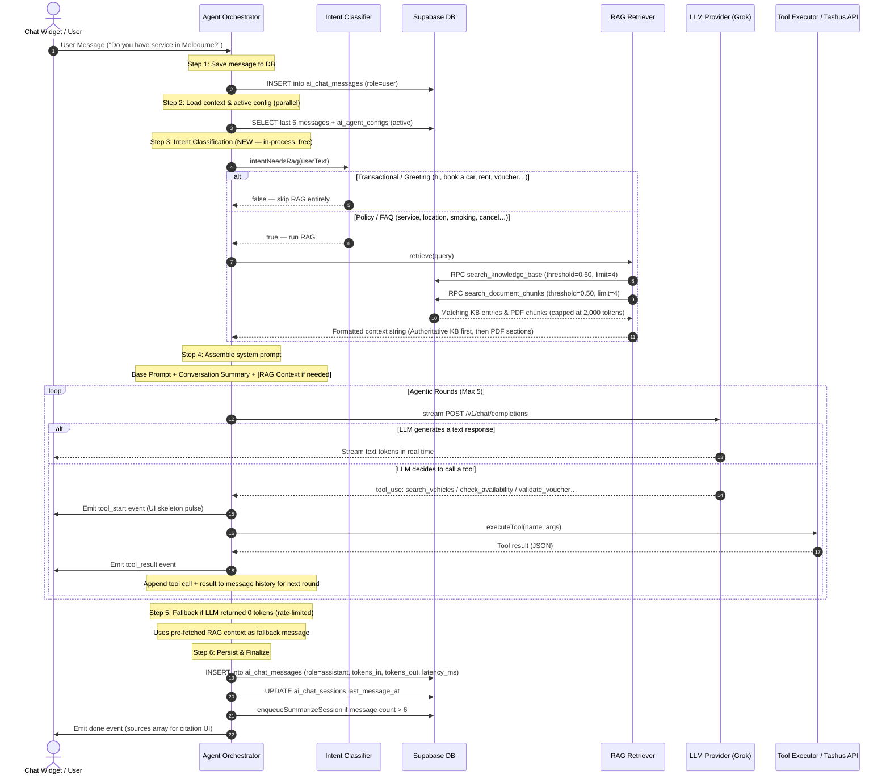
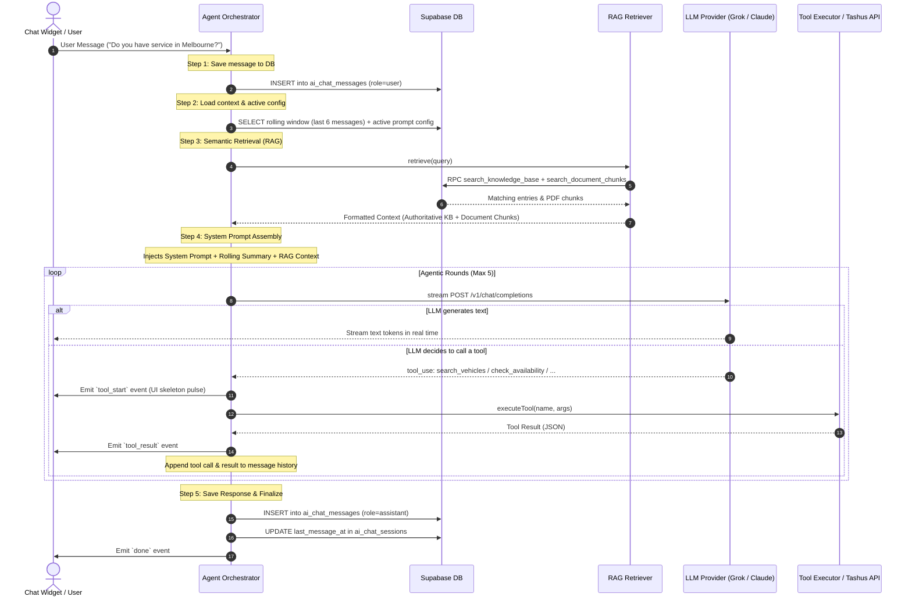

# Tashus AI Chatbot — Token Audit & Flow Analysis

> **Last Updated:** July 14, 2026  
> **Status:** Reflects live implementation in `ai-backend/src/agent/orchestrator.ts` and `ai-backend/src/rag/retriever.ts`

---

## 1. Chatbot Execution Flow (Current Implementation)

The chatbot operates on a multi-round **agentic loop** that combines selective Retrieval-Augmented Generation (RAG) with tool execution (for live vehicle/voucher queries).

### Visual Sequence Diagram

---

## 2. Current Token Budget (Post-Optimization)

Two scenarios now exist depending on what `intentNeedsRag()` returns.

### Scenario A: Transactional / Greeting Message (RAG Skipped)

| Segment | Tokens (approx.) | Notes |
| :--- | :--- | :--- |
| Base System Prompt | ~1,050 | Static — guidelines, rich card syntax |
| Conversation Summary | ~100 | Summarized older turns (background job) |
| Rolling Window (last 6 msgs) | ~600 | Recent conversation |
| RAG Context | **0** | Skipped — `intentNeedsRag()` returned `false` |
| User Query | ~25 | |
| **Total Input** | **~1,775 tokens** | |
| LLM Output | ~250 | |

### Scenario B: Policy / FAQ / Document Question (RAG Active)

| Segment | Tokens (approx.) | Notes |
| :--- | :--- | :--- |
| Base System Prompt | ~1,050 | Static |
| Conversation Summary | ~100 | |
| Rolling Window (last 6 msgs) | ~600 | |
| RAG Context (KB + Chunks) | **~800–2,000** | Max 4 KB entries + 4 PDF chunks, capped at 2,000 tokens |
| User Query | ~25 | |
| **Total Input** | **~2,575–3,775 tokens** | |
| LLM Output | ~250 | |

### Pricing Comparison (Current Actuals)

| Provider / Model | Input Cost (per 1M) | Output Cost (per 1M) | Cost (Scenario A) | Cost (Scenario B) | Groq Free TPD (100K tokens) |
| :--- | :--- | :--- | :--- | :--- | :--- |
| **Groq** (Llama 3.3 70B) | $0.59 | $0.79 | **$0.00105** | **~$0.0022** | ~56 turns (A) or ~26 turns (B) per day |
| **Anthropic** (Claude 3.5 Sonnet) | $3.00 | $15.00 | **$0.0057** | **~$0.0151** | N/A — billed per token |

> **Note:** The original token cost was ~$0.00285/turn for Groq before optimization. Scenario A messages (greetings, vehicle searches) now cost **63% less**. Scenario B policy questions cost **22% less**.

---

## 3. Resolved Issues (Implemented)

| Issue | Status | Resolution |
| :--- | :--- | :--- |
| RAG context injected on every message | ✅ **Fixed** | `intentNeedsRag()` classifier skips RAG for greeting/transactional messages |
| `CHUNK_LIMIT = 8` (too many PDF chunks) | ✅ **Fixed** | Reduced to `CHUNK_LIMIT = 4` |
| `KB_LIMIT = 5` (too many KB entries) | ✅ **Fixed** | Reduced to `KB_LIMIT = 4` |
| `MAX_CONTEXT_TOKENS = 3000` (too high) | ✅ **Fixed** | Reduced to `MAX_CONTEXT_TOKENS = 2000` |
| No similarity filter on document chunks | ✅ **Fixed** | Added `CHUNK_SIMILARITY_THRESHOLD = 0.50` — irrelevant PDF sections discarded |
| Mock embeddings were hash-only (no semantic overlap) | ✅ **Fixed** | Upgraded to **smart word-averaging** algorithm; KB entries re-embedded |
| KB FAQ returning 0 results (threshold mismatch) | ✅ **Fixed** | `KB_SIMILARITY_THRESHOLD` lowered from `0.75` to `0.60` |
| Grok stream errors swallowed silently | ✅ **Fixed** | Added `[Grok Stream Error]` logging inside stream parser |
| Upload route bypassing real Supabase storage (local-dev mode) | ✅ **Fixed** | All uploads now go to real Supabase Storage + inline `/api/ai/ingest` |
| OpenAI API quota exceeded (429) | ✅ **Handled** | Auto-fallback to `MockEmbeddingProvider` when dummy API key detected |

---

## 4. Remaining Optimization Opportunities (Not Yet Implemented)

| Strategy | Potential Savings | Complexity | Notes |
| :--- | :--- | :--- | :--- |
| **Prompt Caching (Anthropic)** | Up to 90% on static blocks | Low | Add `cache_control: { type: "ephemeral" }` to Base System Prompt block in Claude SDK calls |
| **Real semantic embeddings (OpenAI / Voyage)** | Improves RAG precision — fewer false positives injected | Low | Requires an active paid API key. Switch `EMBEDDING_PROVIDER_API_KEY` in `.env.local` |
| **Groq Tier Upgrade** | 10M TPD (100× free tier) | Low | Upgrade account at `console.groq.com/settings/billing` to Dev Tier |
| **Hybrid Re-Ranking (cross-encoder)** | Removes top-K noise from RAG | Medium | Run a lightweight cross-encoder over the top 10 candidates before injecting context |
| **Conversation Summary on every turn** | Reduces rolling window size | Medium | Currently triggered only after 6+ messages via background job |

---

## 1. Chatbot Execution Flow

The chatbot operates on a multi-round **agentic loop** that combines Retrieval-Augmented Generation (RAG) with tool execution (for live vehicle/voucher queries). 

### Visual Sequence Diagram

---

## 2. In-Depth Token Cost Analysis

Every single turn (user message → assistant response) sends a full payload containing the system instructions, conversation history, and RAG context to the LLM. 

### Token Budget Breakdown (Estimated Per Turn)

| Segment | Characters | Tokens (approx.) | Volatility | Description |
| :--- | :--- | :--- | :--- | :--- |
| **Base System Prompt** | ~4,200 | ~1,050 | Static | Guidelines, rules, and rich card syntax |
| **Conversation Summary** | ~400 | ~100 | Static | Summarized history of older turns |
| **Rolling Window History** | ~2,400 | ~600 | Low | Raw content of the last 6 messages |
| **RAG Retrieval Context** | ~10,000–12,000 | ~2,500–3,000 | **High** | Chunks retrieved from PDFs & KB |
| **User Query** | ~100 | ~25 | Low | The current question asked by the user |
| **Total Input Payload** | **~17,100–19,100** | **~4,275–4,775** | — | **Sent to the LLM on every API call** |
| **LLM Output (Final Response)** | ~1,000 | ~250 | Low | Text response + formatted rich card tags |

### Pricing Comparison (Real-World Costs)

Based on current API pricing for **Groq** and **Anthropic** (per 1,000,000 tokens):

| Provider / Model | Input Cost (per 1M) | Output Cost (per 1M) | Cost Per Simple Turn (4.5K in, 250 out) | Max Turns for $1.00 USD |
| :--- | :--- | :--- | :--- | :--- |
| **Groq** (Llama 3.3 70B) | $0.59 | $0.79 | **$0.00285** | **~350 turns** |
| **Anthropic** (Claude 3.5 Sonnet) | $3.00 | $15.00 | **$0.01725** | **~58 turns** |

---

## 3. High Token Consumption Issues

Currently, there are three primary design inefficiencies driving up your token costs:

1. **RAG Context is Injected unconditionally**:
   The orchestrator runs `retrieve(userText)` and appends up to **8 document chunks** (each up to 512 tokens) and **5 KB entries** to the system prompt on **every single message**.
   - *Impact*: Adds 2,500+ tokens (~$0.01 per query on Claude) even if the user is saying a simple "hi" or asking a question that is already answered by previous history.
   
2. **Double-Retrieval overhead (RAG + Tool)**:
   The orchestrator automatically retrieves context *and* exposes a `search_knowledge_base` tool. This means the model sometimes calls the tool, executing the RAG logic twice in the same turn and doubling the payload size for subsequent rounds.

3. **No Prompt Cache exploitation**:
   Since the RAG context changes dynamically on every single user message, cloud LLM providers (like Anthropic) cannot cache the system prompt. This prevents you from saving up to **90%** of input token costs through prompt caching.

---

## 4. Actionable Strategies to Restructure & Reduce Costs

To optimize the system and lower token costs by **60% to 80%**, we should apply the following restructuring strategies:

### Strategy A: Selective RAG Ingestion (Pruning)
Instead of retrieving and injecting PDF chunks on *every* turn:
- Exclude the RAG context from the default prompt if the user's query is conversational (e.g. "hello", "thank you") or triggers another database/API tool (like `search_vehicles`).
- Only run semantic retrieval if the user's intent is classified as policy/faq support.

### Strategy B: Tighten Chunk Retrieval Limits
Currently, the retriever has:
- `CHUNK_LIMIT = 8` (8 * 512 tokens = up to 4,096 tokens)
- `KB_LIMIT = 5` (5 * 200 tokens = up to 1,000 tokens)
- *Optimization*: Reduce `CHUNK_LIMIT` to `4` and `KB_LIMIT` to `3`. This guarantees that the maximum retrieved context size drops from **5,000 tokens** to **2,500 tokens** without sacrificing accuracy.

### Strategy C: Utilize Prompt Caching (Anthropic)
For Anthropic, you can designate block-level breakpoints in the system prompt for caching. 
- *How*: Keep static blocks (Base System Prompt, Core Directives) at the top of the prompt and mark them with `cache_control: { type: "ephemeral" }` via the SDK. This reduces the cost of that static 1,050-token block by **90%** (saving $2.70 per million tokens).
